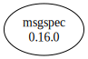

# Third Party Dependencies

<!--[[[fill sbom_sha256()]]]-->
The [SBOM in CycloneDX v1.4 JSON format](https://git.sr.ht/~sthagen/synkronoida/blob/default/etc/sbom/cdx.json) with SHA256 checksum ([8b0bac1f ...](https://git.sr.ht/~sthagen/synkronoida/blob/default/etc/sbom/cdx.json.sha256 "sha256:8b0bac1f8f5f620d596a3aa6e0ac259566e3abf750a39edb6296a15f266a4705")).
<!--[[[end]]] (checksum: 659af37792a3e9c7f0778e664976f2e6)-->
## Licenses 

JSON files with complete license info of: [direct dependencies](direct-dependency-licenses.json) | [all dependencies](all-dependency-licenses.json)

### Direct Dependencies

<!--[[[fill direct_dependencies_table()]]]-->
| Name                                        | Version                                            | License     | Author  | Description (from packaging data)                                                                        |
|:--------------------------------------------|:---------------------------------------------------|:------------|:--------|:---------------------------------------------------------------------------------------------------------|
| [msgspec](https://jcristharif.com/msgspec/) | [0.16.0](https://pypi.org/project/msgspec/0.16.0/) | BSD License | UNKNOWN | A fast serialization and validation library, with builtin support for JSON, MessagePack, YAML, and TOML. |
<!--[[[end]]] (checksum: 5c1cd2f0d95c6f6c21a218cb4eac68f2)-->

### Indirect Dependencies

<!--[[[fill indirect_dependencies_table()]]]-->
| Name | Version | License | Author | Description (from packaging data) |
|:-----|:--------|:--------|:-------|:----------------------------------|
<!--[[[end]]] (checksum: 8a87b89207db0be2864af66f9266660c)-->

## Dependency Tree(s)

JSON file with the complete package dependency tree info of: [the full dependency tree](package-dependency-tree.json)

### Rendered SVG

Base graphviz file in dot format: [Trees of the direct dependencies](package-dependency-tree.dot.txt)



### Console Representation

<!--[[[fill dependency_tree_console_text()]]]-->
````console
msgspec==0.16.0
````
<!--[[[end]]] (checksum: 65c530d389ea3bf9a288fd12fdb4b161)-->
